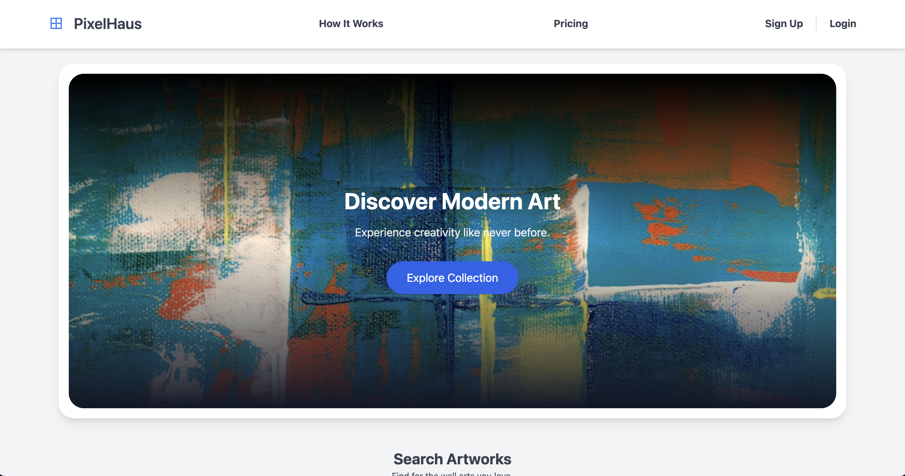
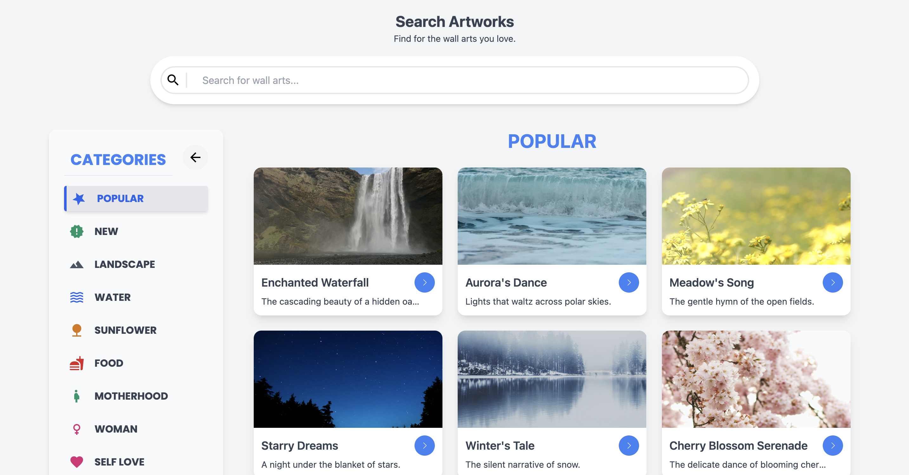
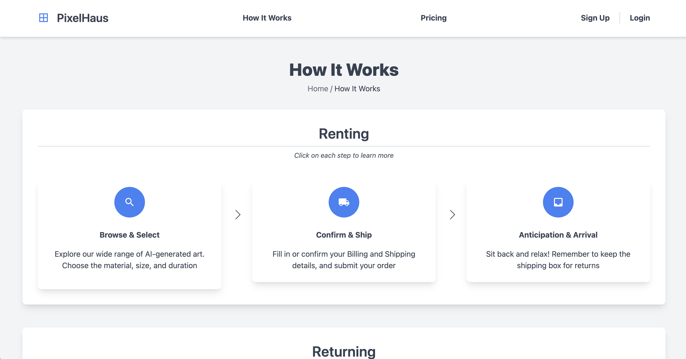
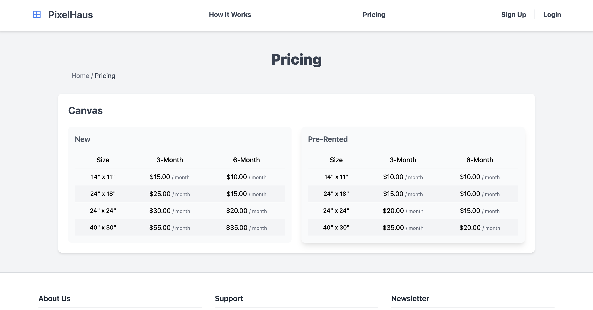
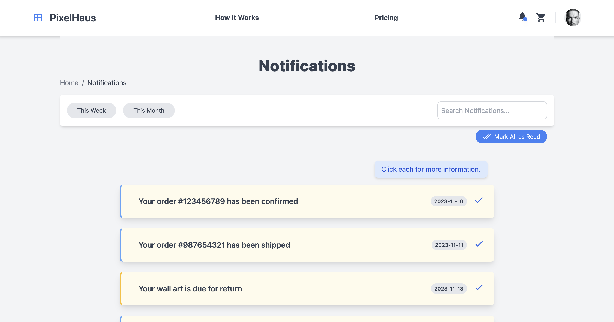
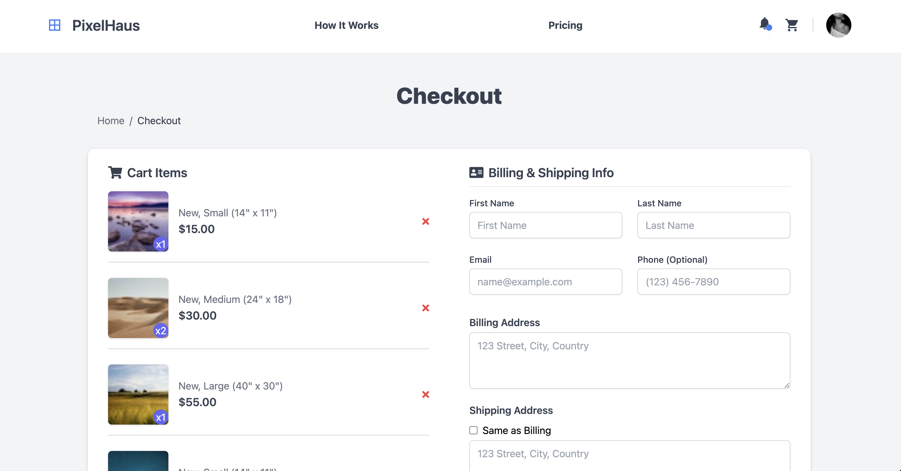

# PixelHaus

## What Is It?
PixelHaus is a dynamic online platform for renting AI-generated wall art. The app offers a unique experience for users to explore and rent various AI-generated artworks for their spaces at a fixed monthly price. The user interface is sleek, intuitive, and responsive, thanks to the use of Vue.js and TailwindCSS. Users can browse an extensive gallery, select their favorite pieces, and visualize them in their space with a sophisticated preview feature.

## Why Build It?
The inspiration for PixelHaus stems from the increasing trend of AI-generated imagery. With an abundance of stunning, but often unused, AI creations, PixelHaus aims to give these artworks a purpose. The platform not only provides a repository for personal favorites but also offers a revenue-sharing model for third-party artists. It's a unique solution to valorize AI art and make it accessible for a wider audience.

## Table of Contents
1. [Features](#features)
2. [Technologies Used](#technologies-used)
3. [Getting Started](#getting-started)
4. [Usage](#usage)
5. [Screenshots](#screenshots)
6. [Challenges and Learnings](#challenges-and-learnings)
7. [Future Enhancements](#future-enhancements)
8. [Contact](#contact)

## Features
- Extensive gallery of AI-generated art
- Easy-to-use art renting system
- Real-time preview feature to visualize art in your space
- Support for third-party artists with revenue sharing
- Responsive design for seamless browsing on any device

## Technologies Used
PixelHaus is primarily built using: **Vue.js** and **TailwindCSS**.

Additional libraries: Animate.css, AOS for animations, Day.js for date handling, and Vue Clerk for auth state management.

## Getting Started
To get PixelHaus running locally:

```bash
# Clone the repository
git clone https://github.com/dionisggr/pixelhaus.git
cd pixelhaus

# Install dependencies
npm install

# Start the local server
npm start
```

## Usage
### Catalog
Navigate to the website to explore the diverse world of AI-generated art. Browse the extensive gallery and select a piece that resonates with your style. Each artwork comes with a choice of rental plans, catering to different preferences and durations. Check out the How It Works section for more information on the rental process. Read into the Pricing section for more details on the different plans.

### Notifications
Notifications are designed to be informative yet unobtrusive, ensuring you're always in the loop without overwhelming your experience. Users receive updates about new art additions, rental renewals, and special promotions

### Cart
The cart feature provides a streamlined and secure process for finalizing your art rentals. It allows you to review selected artworks, manage rental durations, and proceed to a hassle-free checkout. The cart is designed for clarity and ease of use, ensuring a smooth transition from selection to enjoyment of your chosen art.

### Checkout
The checkout process is streamlined and secure. Simply add your shipping address and payment details, including credit card information, to complete your rental. This efficient and secure step ensures a quick and safe transaction, bringing your chosen AI-generated art one step closer to adorning your space

## Screenshots








## Challenges and Learnings
The primary challenge was crafting a seamless user experience, especially integrating a feature to preview art on a manually designed virtual wall. This required meticulous design and image placement to ensure a realistic representation. Additionally, implementing an efficient notification system without real-time updates was a key learning experience, favoring scheduled interval scanning over websockets for user notifications.

## Future Enhancements
- Introduce more interactive elements in the UI.
- Expand the art collection with more diverse AI-generated art.
- Design a side-view for the preview feature.
- Implement real-time chat support for user assistance.
- Printify API integration for orders.
- Payment processing.

## Contact
Reach out for more information or collaboration opportunities:

- [Portfolio](https://www.dioveloper.com/)
- [LinkedIn](https://www.linkedin.com/in/dionis-gonzalez/)
- [Email](dionisggr@gmail.com)
